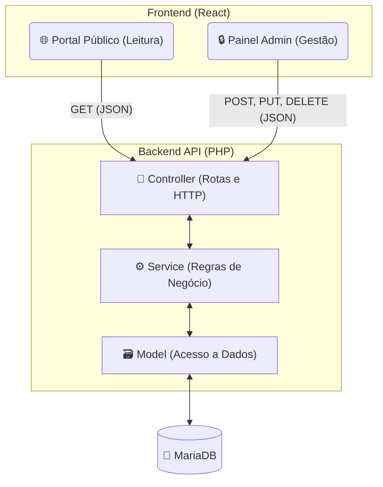

# 🏛️ Portal e CMS - Prefeitura de Itapororoca

## 📍 Sobre o Projeto
Este projeto é um portal institucional e um Sistema de Gestão de Conteúdo (CMS) desenvolvido para a Prefeitura Municipal de Itapororoca. O objetivo é fornecer uma plataforma pública de transparência e notícias para os cidadãos, juntamente com um painel administrativo para a gestão dinâmica do conteúdo.

## 🏗️ Arquitetura do Sistema

O sistema é construído sobre uma arquitetura **API RESTful**, separando completamente as responsabilidades do cliente (Frontend) e do servidor (Backend). A comunicação entre as pontas é feita exclusivamente via **JSON**.

### 🔄 Fluxo de Requisições e Camadas:
1. **Frontend (React):** Realiza chamadas HTTP assíncronas (Axios/Fetch). O Portal Público consome dados (GET), enquanto o Admin envia mutações (POST para criar, PUT para editar, DELETE para excluir).
2. **API PHP (Controller):** Intercepta a requisição, realiza a validação de autenticação (ex: JWT no Painel Admin) e roteia os dados recebidos.
3. **API PHP (Service):** Processa as regras de negócio, como validação de formulários, tratamento de uploads de imagens e formatação de textos.
4. **API PHP (Model):** Executa as operações de CRUD diretamente no banco de dados.
5. **MariaDB:** Banco de dados relacional que armazena usuários, postagens, leis e configurações do portal.

## 🛠️ Stack Tecnológica

* **Frontend:** React.js, HTML5, CSS3, Bootstrap 5 (Estilização base).
* **Backend:** PHP (API RESTful).
* **Banco de Dados:** MariaDB.
* **Comunicação:** Formato JSON.

## 📌 Status do Projeto

* [x] Prototipação das telas em HTML/CSS estático.
* [ ] Desenvolvimento da API Rest em PHP.
* [ ] Modelagem do banco de dados (MariaDB).
* [ ] Integração do Frontend (React) com a API.
* [ ] Construção do Painel Administrativo.

## 👨‍💻 Autores
* Elder
* Nathyanne

2026