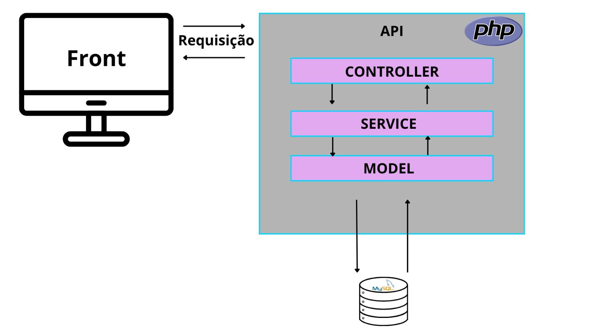

# 📘 README.md — Portal da Prefeitura de Itapororoca

## 📍 Sobre o Projeto

Este projeto é um site institucional desenvolvido para a Prefeitura Municipal de Itapororoca, com foco em transparência, informação pública e comunicação com os cidadãos.

A interface é responsiva e construída com Bootstrap, oferecendo uma navegação simples e acessível.

## Arquitetura do Sistema

<p align="center">
  
</p>

## 🎯 Estrutura do Site

O site é dividido nas seguintes seções:

### 🏠 Navbar (Menu de Navegação)

* Links para:

  * Nossa História
  * A Prefeitura
  * Leis Municipais
  * Notícias
  * Contato

### 🌄 Hero (Página Inicial)

* Mensagem de boas-vindas
* Destaque institucional:

  > “Transparência, desenvolvimento e compromisso com o cidadão.”

### 📖 História de Itapororoca

* Espaço para conteúdo histórico do município
* Área reservada para imagem ilustrativa

### 🏛️ A Prefeitura

* Informações institucionais
* Endereço e horário de atendimento
* Espaço para imagem da prefeitura ou gestão

### 📜 Leis Municipais e Transparência

* Botão de acesso para documentos públicos
* Área dedicada à transparência administrativa

### 📰 Notícias

* Cards com:

  * Imagem
  * Título
  * Resumo
  * Botão “Leia mais”

### 📩 Contato

* Formulário com:

  * Nome
  * E-mail
  * Mensagem
* Preparado para integração com backend

### ⚫ Rodapé (Footer)

* Direitos autorais
* Créditos de desenvolvimento

## 🛠️ Tecnologias Utilizadas

* HTML5
* CSS3 (arquivo `style.css`)
* Bootstrap 5.3
* JavaScript (Bootstrap Bundle)

CDNs utilizados:

* Bootstrap CSS
* Bootstrap JS

## 🚀 Como Executar

1. Salve o arquivo como `index.html`
2. Crie um arquivo `style.css` na mesma pasta
3. Abra o arquivo no navegador

## 📂 Estrutura de Arquivos

```id="g2k91x"
/projeto-itapororoca
│── index.html
│── style.css
│── /images (opcional)
```

## 🎨 Personalização

Você pode customizar:

* Imagens (`image-placeholder`)
* Cores no `style.css`
* Conteúdo das seções
* Links reais (ex: portal da transparência)

## 🔐 Melhorias Futuras

* Integração com backend (PHP, Node.js ou Python)
* Sistema de login (contracheques)
* CMS para notícias
* Banco de dados (MySQL/PostgreSQL)
* API de transparência pública

## 📢 Objetivo

Facilitar o acesso à informação pública e fortalecer a transparência da gestão municipal de Itapororoca.

## 👨‍💻 Autores

* Elder
* Nathyanne

## 📄 Licença

Projeto de uso institucional e educacional.

